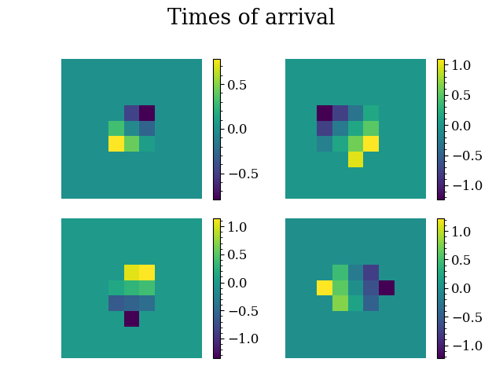
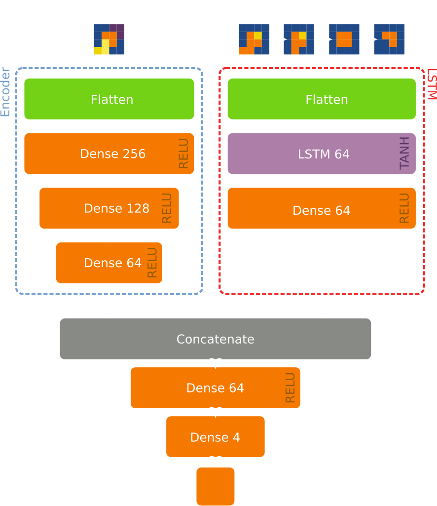
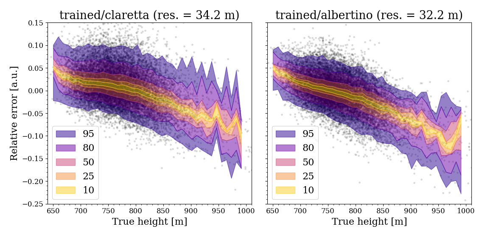

# LstmEncoder for UHECR AirShowers

In this project, we propose an example of using deep learning techniques to predict features of UHECR 
(Ultra High Energy Cosmic Rays) Showers.
In particular, when this kind of cosmic ray enters the atmosphere, they produce a particle cascade 
that can be identified with a set of water-Cherenkov or scintillator ground-based detectors. We aim to train a neural network to predict the height at which the shower formed by feeding it with data on the triggers of such detectors.

The reference for the dataset and the project we are inspired to can be found at:
https://arxiv.org/pdf/2107.00656.pdf

## Dataset
The dataset is organised as follows. Every single data is made of a 9x9 matrix, where every single element represents a detector. 
###Timeseries
In the case of timeseries the value related to each detector is the energy deposited by the passage of charged particle of the shower, and all together represents the evolution in time as the shower pass by.

###Time of arrivals
In the case of time of arrivals the values of the matrix represents the first time at which each detector was lit.

## Model
The network we built is a Concatenation of an LSTM (Long Short Term Memory) network for the timeseries and an Encoder network for the time of arrivals, ended with a series of dense layers that gives back a continuous output for the height of the shower.

## Results
At the end of the training procedure our network reached an accuracy (RMSE?) of: (?) We augmented in the preprocessing phase the less represented data.
 

## Table of contents
- In cloudatlas directory can be found modules related to the network
- In ppproc modules related to preprocessing
- In test are test modules
- In docs can be found the abstract and the slides
